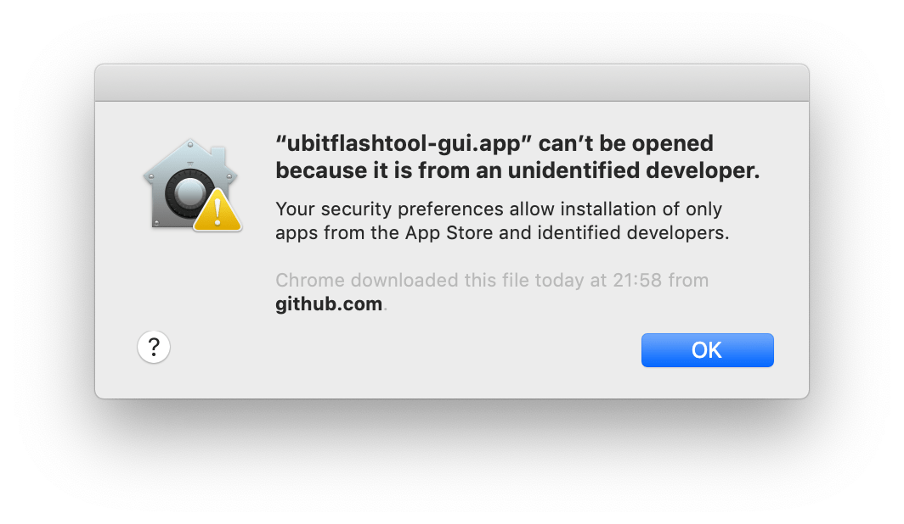
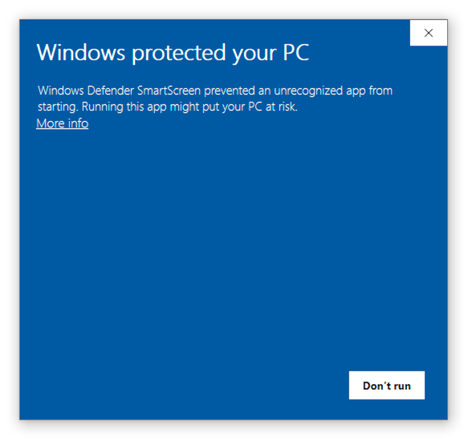
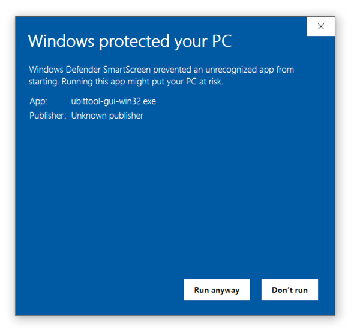

# How To Install uBitTool

There are three ways to install uBitTool:

- Download the executables (no installation required, they are ready to run)
- Install as a Python 3 package from PyPI
- Install the Python 3 package from source

## Executables

The latest version of the executables can be downloaded from the
[GitHub Releases page](https://github.com/carlosperate/ubittool/releases).

Only macOS and Windows executables are currently build. If you are using Linux
you can follow any of the other installation methods.

There is no need to install these applications, they are self-contain
executables that can be run simply by double clicking them.

However, the applications have not been signed as that is a process that
costs money, and this is a personal open source project. So, as unsigned
applications your Operating System might show you a warning about this.

### macOS

Download the latest version for `mac` from the
[GitHub Releases page](https://github.com/carlosperate/ubittool/releases).

If you double click on the executable in macOS you might see a warning like
this one:


The first time you open the application you will have follow these steps:

- Right click on the ubittool-gui.app file
- Select Open
  
- A different warning window now offers more options
- Click "Open" and the app will now work
  

This is only required the first time, any subsequent double clicks will
instantly open uBitTool without these warnings.

More information about these steps and why this is necessary can be found in
the Apple support website:
[https://support.apple.com/en-gb/guide/mac-help/mh40616/mac](https://support.apple.com/en-gb/guide/mac-help/mh40616/mac)

### Windows

- Download the latest version for `win32` from the
  [GitHub Releases page](https://github.com/carlosperate/ubittool/releases).
- Double click on the .exe file
- A warning will appear indicating that "Windows protected your PC". This is
  because the application is not signed, as explained in the into of the parent
  section.
  
- Click on the "More info" link
- A button should appear to "Run anyway"
  
- Click the "Run anyway" button and the app should open

## Python Package

This application is provided as a Python 3 (>3.5) package.

Using [pipx](https://pipxproject.github.io/pipx/) is not necessary, but highly
encouraged, as it will automatically create a virtual environment, install
uBitTool and add its executable to the system path. This way the command can
be used from any terminal session without the need to manually activate a
virtual environment.

If you don't have `pipx` already installed, follow the
[pipx installation instructions](https://pipxproject.github.io/pipx/installation/).

Then:

```
$ pipx install ubittool
```

Alternatively, create a Python 3 (>3.5) virtual environment and install the
`ubittool` package inside:

```
$ pip install ubittool
```

You can pip install uBitTool without a virtual environment, but there are a lot
of reason why that is not a good idea. A bit more info can be found
[here](https://stackoverflow.com/a/41972262/775259).

## Installing from source

For information about how to install uBitTool from source please consult the
[uBitTool Development documentation](development.html).
